<p align="center"><a href="https://laravel.com" target="_blank"></a></p>

# Laravel Boilerplate

A production-ready Laravel boilerplate to help you kickstart your next web application. It comes with a powerful admin panel and essential features required by most content management systems and business applications.

## Features

- User authentication
- Admin dashboard
- User management
- Blog posts
- Dynamic pages
- File manager
- Multiple frontend themes
- Dynamic menus
- Chat between admin and users
- Contact Us
- Website settings
- Responsive design

## Admin Panel

The admin dashboard allows you to manage your entire website from a single place.

### Dashboard
- Website overview
- Statistics and quick access to modules

### Users
- Add, edit, block, restore, and permanently delete users
- Manage user profiles

### Blog Posts
- Create, edit, publish, restore, and permanently delete blog posts

### Dynamic Pages
- Create and manage pages such as:
  - About Us
  - Privacy Policy
  - Terms & Conditions
  - Any custom page

### File Manager
- Upload files and images
- Organize uploaded files
- Reuse uploaded media across the application

### Themes
- Support for multiple frontend themes
- Easily switch between themes

### Menus
- Create dynamic menus
- Reorder menu items
- Build custom navigation

### Chat
- Built-in messaging system between administrators and users

### Contact Us
- View and manage messages submitted through the Contact Us form

### Settings
Manage application settings including:

- Website name
- Website logo
- Other general settings

## Requirements

- PHP 8.2+
- Laravel
- MySQL
- Composer

## Installation

```bash
git clone <repository-url>

cd <project-folder>

composer update

php artisan key:generate
```

Update your database credentials in `.env`.

Run migrations:

```bash
php artisan migrate
```

Run seeder:

```bash
php artisan db:seed
```

Create storage link:

```bash
php artisan storage:link
```

Start the development server:

```bash
php artisan serve
```

## Screenshots

### Dashboard

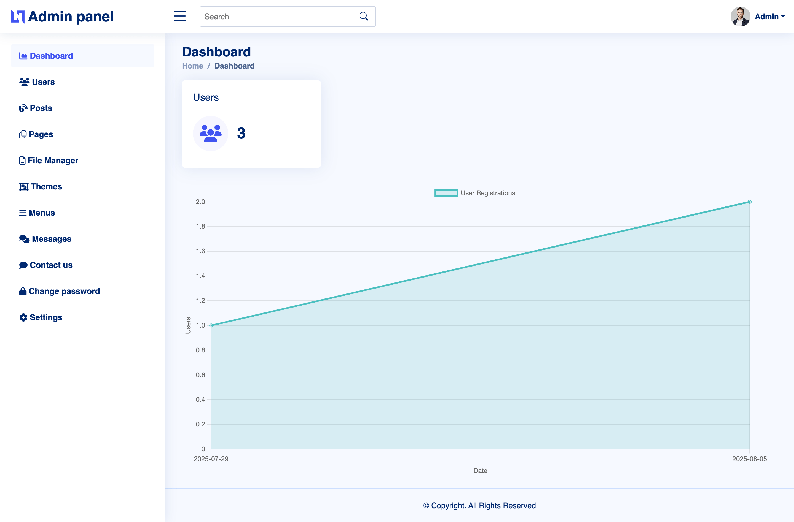

### Users

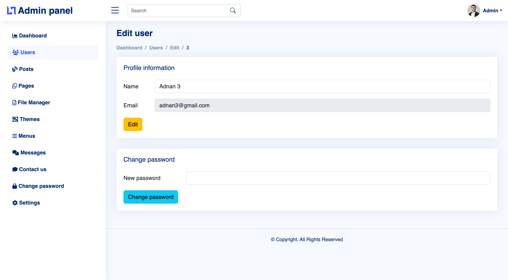

### Posts

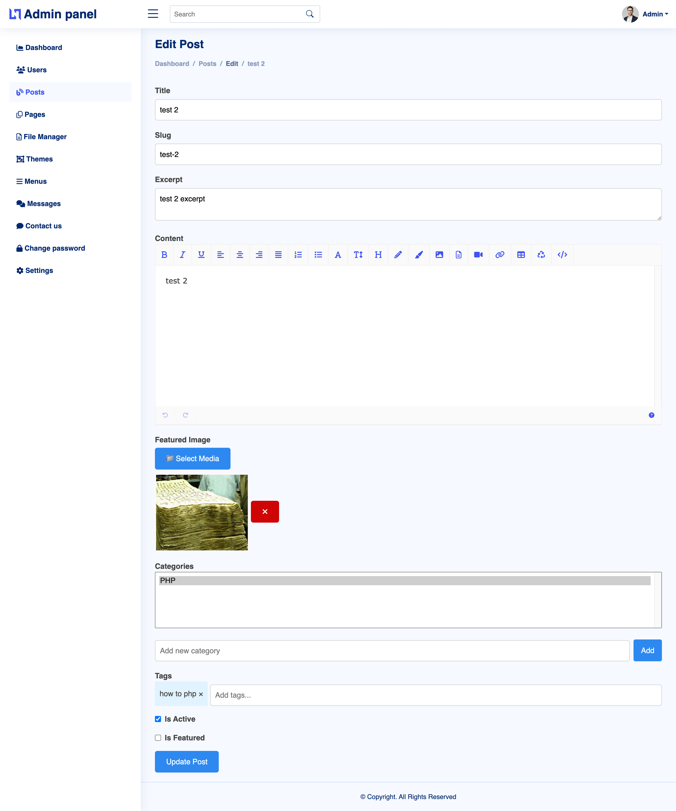

### Pages

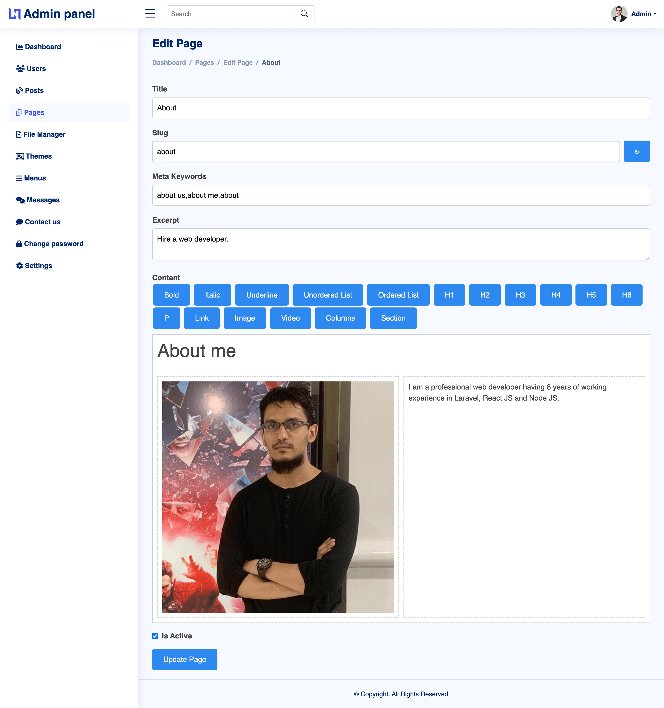

### Chat

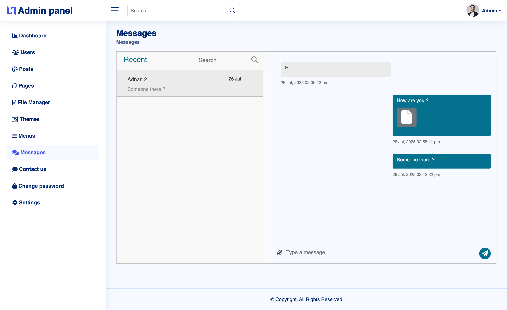

### Files Manager

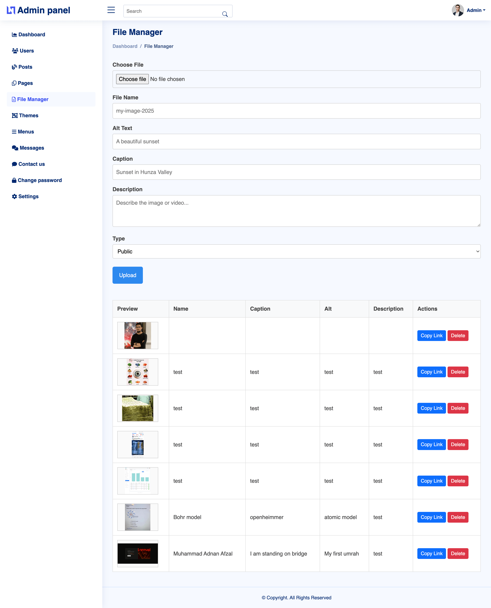

### Menus

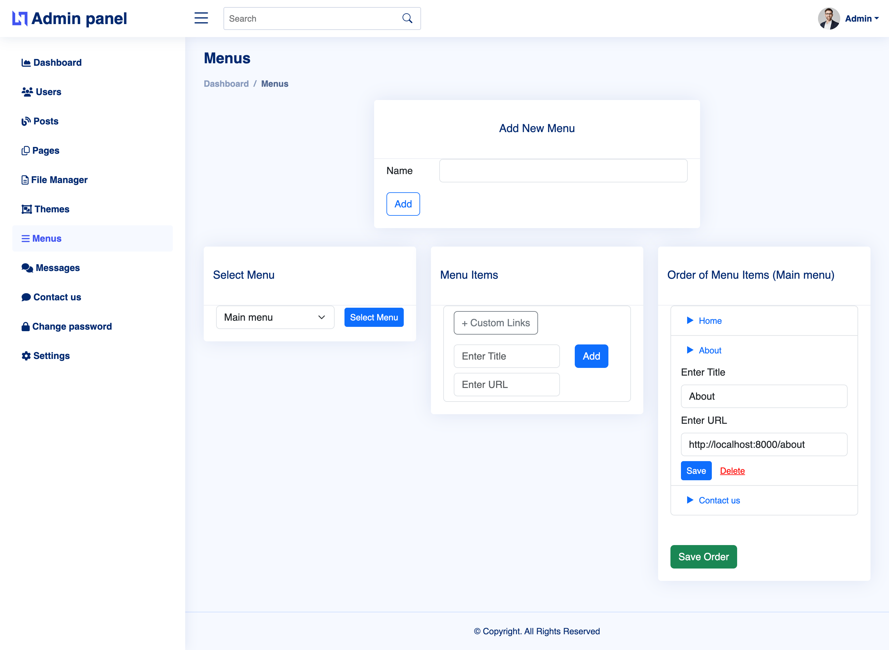

### Contact Us

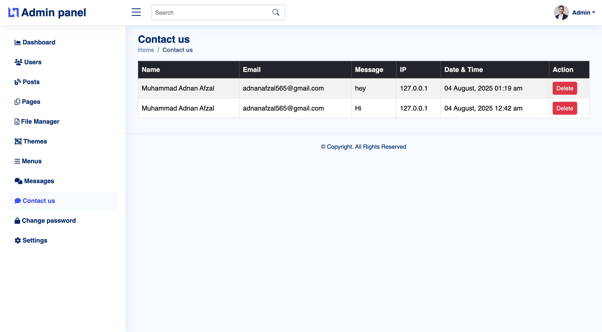

### Settings

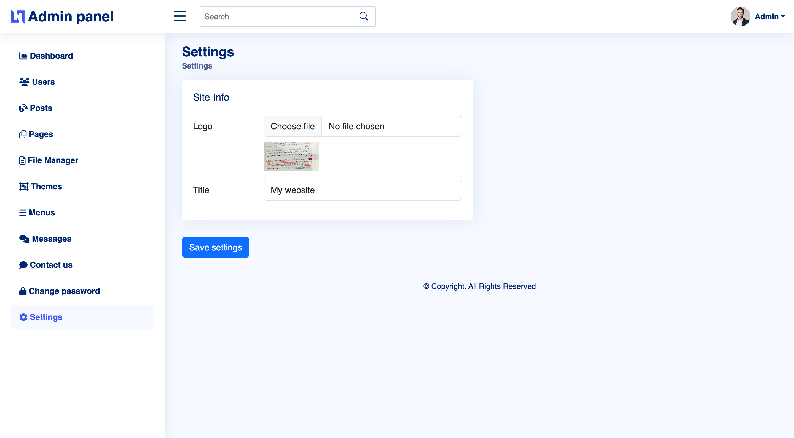

### Theme 1

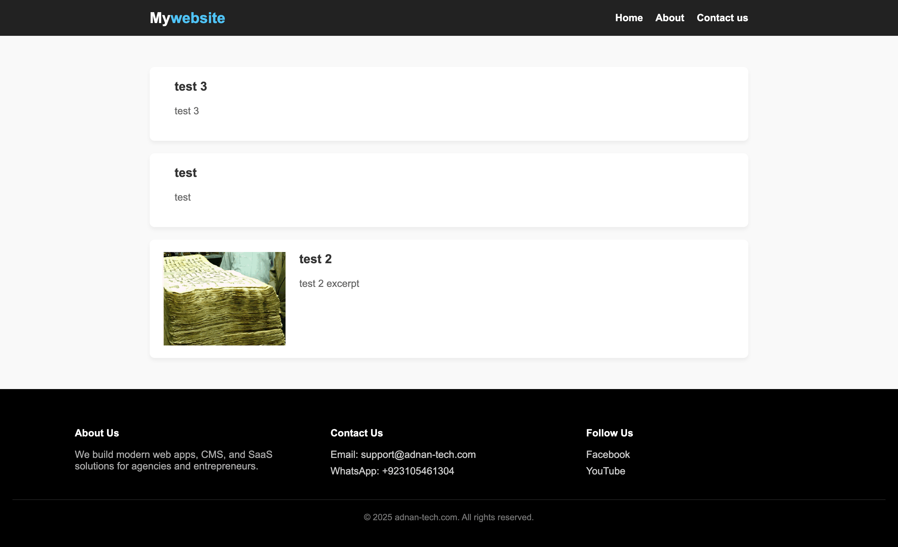

### Theme 2

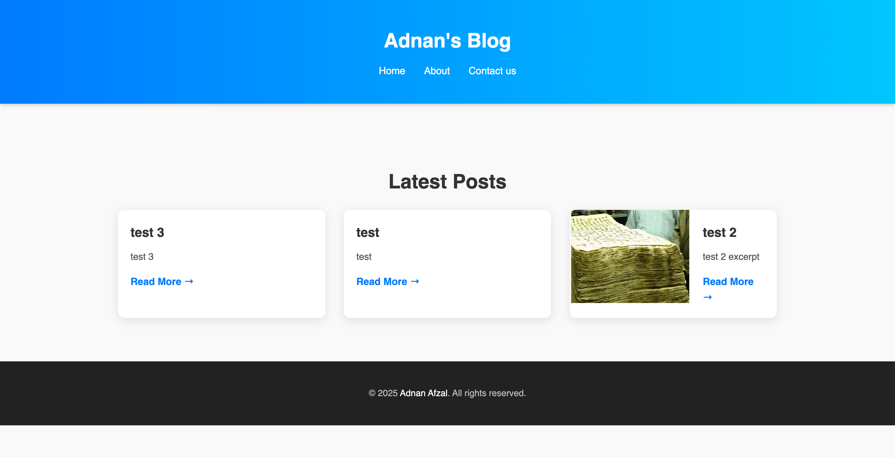

### Theme 3

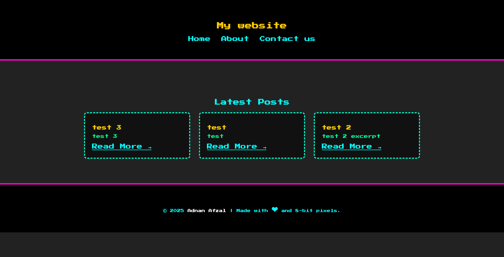

## Customization

Need additional features?

I provide Laravel development and customization services. If you need custom modules, API integrations, UI improvements, new themes, or any other functionality, feel free to contact me.

## Contributing

Pull requests and suggestions are welcome.

## License

This project is licensed under the MIT License.